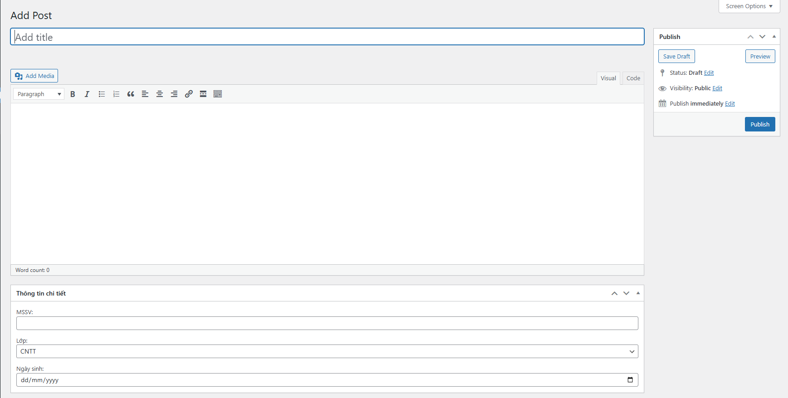

Sinh viên thực hiện: [Nguyễn Hữu Thành]
Mã số sinh viên: [23810310389]

🎓 Student Manager Plugin for WordPress
Student Manager là một plugin WordPress nhẹ, được thiết kế để giúp quản trị viên quản lý thông tin sinh viên một cách khoa học thông qua Custom Post Type và Meta Boxes.

## 🖼️ Kết quả thực hiện

| Giao diện Admin |
| :---: | :---: |
|  

| Giao diện Sinh Viên | 
| :---: | :---: |
|  

📂 Cấu trúc thư mục (Folder Structure)
Bạn có thể tham khảo cấu trúc file bên dưới để tổ chức mã nguồn:

Plaintext
student-manager/
├── assets/
│   └── style.css           # Định dạng CSS cho bảng hiển thị ở Frontend
├── includes/
│   ├── class-cpt.php       # Đăng ký Custom Post Type "Sinh viên"
│   ├── class-metabox.php   # Xử lý các trường dữ liệu bổ sung (MSSV, Lớp, Ngày sinh)
│   └── class-shortcode.php # Xử lý Shortcode hiển thị danh sách sinh viên
└── student-manager.php     # Tệp chính kích hoạt Plugin và nạp các thành phần
✨ Tính năng chính
1. Quản trị hệ thống (Backend)
Custom Post Type: Tạo mục "Sinh viên" riêng biệt trong Menu Admin.

Custom Meta Box: Thêm các trường dữ liệu chuyên sâu:

MSSV: Mã số định danh sinh viên.

Lớp/Chuyên ngành: Chọn từ danh sách (CNTT, Kinh tế, Marketing).

Ngày sinh: Chọn từ lịch (Date picker).

Bảo mật: Sử dụng Nonce để xác thực và Sanitization để làm sạch dữ liệu trước khi lưu vào database.

2. Hiển thị dữ liệu (Frontend)
Sử dụng Shortcode đơn giản: [danh_sach_sinh_vien].

Dữ liệu được trình bày dưới dạng bảng HTML chuẩn, dễ nhìn, hỗ trợ Responsive cơ bản.

🚀 Hướng dẫn cài đặt
Tải thư mục student-manager lên thư mục /wp-content/plugins/.

Truy cập vào Plugins (Gói mở rộng) trong Dashboard và nhấn Activate (Kích hoạt).

Vào mục Sinh viên để thêm mới thông tin các bạn sinh viên.

Tạo một Trang hoặc Bài viết mới, chèn mã [danh_sach_sinh_vien] vào vị trí mong muốn.

🛠️ Yêu cầu kỹ thuật
WordPress: 5.0 trở lên.

PHP: 7.4 trở lên
